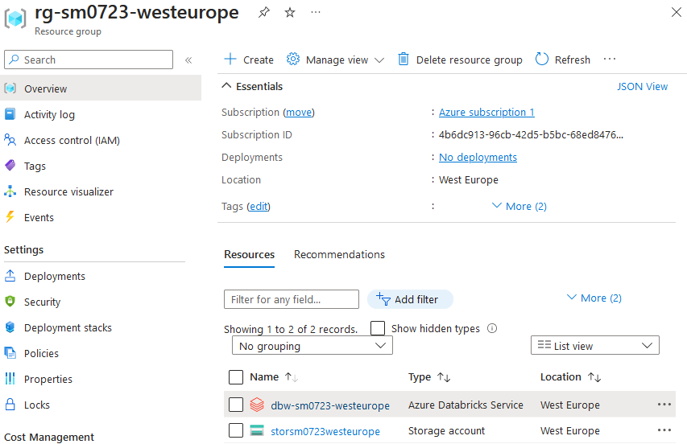
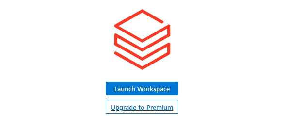
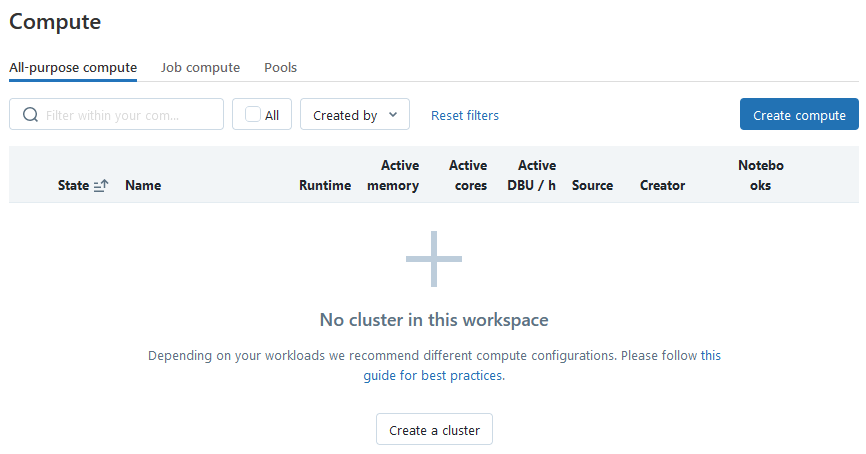
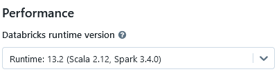
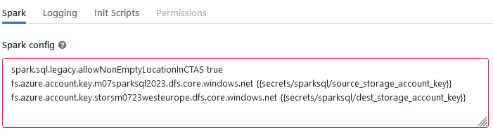
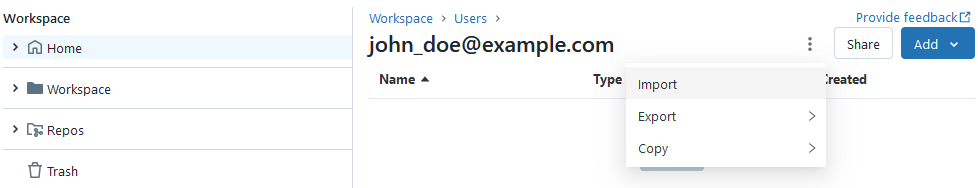
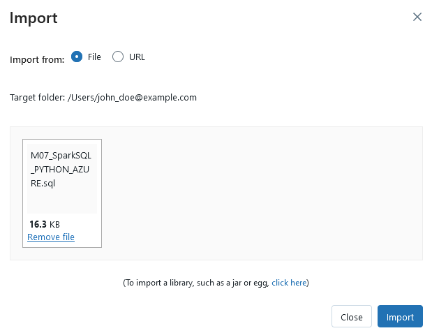
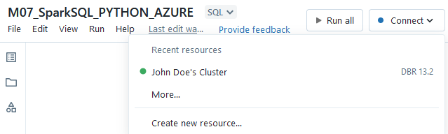
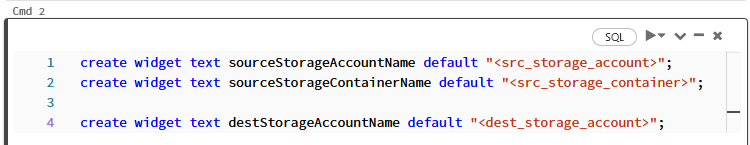

> **⚠ This guide assumes that all commands are executed from the repository root, if not stated otherwise**

# Prerequisites

1. Azure account with active subscription
2. Azure Data Lake Storage Gen2 (hierarchical) containing the source data (hotels, weather and expedia)
3. Bash-compatible environment such as WSL

## For launching the notebook in Azure

1. [Terraform CLI](https://developer.hashicorp.com/terraform/tutorials/azure-get-started/install-cli)
2. [Azure CLI](https://learn.microsoft.com/en-us/cli/azure/install-azure-cli-linux?pivots=apt)
3. [Databricks CLI](https://learn.microsoft.com/en-us/azure/databricks/dev-tools/cli/databricks-cli)

## For launching the queries on local Spark installation

1. [Spark](https://spark.apache.org/downloads.html)
2. Python >= 3.8

# Running the notebook

1. Create the infrastructure 
    - Make `create-azure-env.sh` script executable. To do this, run
        ```sh
        chmod +x create-azure-env.sh
        ```
    - Run the script:
        ```sh
        ./create-azure-env.sh
        ```
    During the execution, the script will ask for 3 inputs:
    1. Azure region: name of Azure location to create all of the resources, including Terraform state
    2. Prefix for the resources: unique prefix which will be prepended to the names of the resources created by this script
    3. Prior to creating the infrastructure, Terraform will ask you if you want to apply it. Please type "`yes`":
        ```
        Do you want to perform these actions?
          Terraform will perform the actions described above.
          Only 'yes' will be accepted to approve.

         Enter a value: yes
        ```

2. Check that your Databricks workspace has been created:
    - Go to Azure Portal
    - Open the resource group containing Azure Databricks Service resource. The group's name will have the following format: `rg-<your prefix>-<azure location>`:

        

    - Go to Azure Databricks Service and open the workspace by clicking "Launch Workspace" button:

        

3. Create Databricks secrets
    - In your home directory, create `.databrickscfg` file if doesn't exist yet:
        ```
        touch ~/.databrickscfg
        ```
    - Add to the file a section for your workspace URL:
        ```
        [sparksql]
        host = https://adb-1827040136424973.13.azuredatabricks.net
        ```
    - Create secrets scope for your workspace:
        ```
        databricks secrets create-scope sparksql --initial-manage-principal users -p sparksql
        ``` 
    - Get access key for the storage account containing source datasets
    - Create a secret for that access key:
        ```
        databricks secrets put-secret sparksql source_storage_account_key -p sparksql
        ```
        Please enter the key when Databricks CLI will ask for it ("Please enter your secret value:")
    - Get access key for the storage account where resulting data will be saved. You can do this either from Azure Portal or by invoking Terraform:
        ```
        terraform -chdir=terraform output -raw storage_account_access_key
        ```
    - Create a secret for that access key:
        ```
        databricks secrets put-secret sparksql dest_storage_account_key -p sparksql
        ```

4. Create cluster in Databricks
    - Open Databricks Workspace
    - From the left menu, go to "Compute" page
    - Press "Create compute" button in the upper-right corner:

        

    - Provide the data required by Databricks for cluster template. For "Databricks runtime version", please choose:

        

    - Open "Advanced options". Add the following lines to "Spark config" input:
        ```
        spark.sql.legacy.allowNonEmptyLocationInCTAS true
        fs.azure.account.key.<src_storage_account>.dfs.core.windows.net {{secrets/sparksql/source_storage_account_key}}
        fs.azure.account.key.<dest_storage_account>.dfs.core.windows.net {{secrets/sparksql/dest_storage_account_key}}
        ```
        Here, `<src_storage_account>` is the name of the storage account with source datasets. 
        `<dest_storage_account>` is the name of the storage account where resulting data will be saved.
        
        

    - Press "Create Cluster" and wait till it's initialized

5. Import the notebook
    - In Databricks Workspace, go to "Workspace" page
    - Choose "Home" tab
    - In the upper-right corner, press **⫶** button and choose "Import":

        

    - Use the dialog to upload the notebook for this exercise (it's in "notebooks" directory of this repo). Then press "Import":

        

    - Open the notebook from the list

6. Running the notebook (finally)
    - Connect the notebook to the cluster:

        

    - Provide values for the widgets: in 2nd command, replace widget values with the actual ones for your environment:

        

        Here, `<src_storage_account>` is the name of the storage account with source datasets. 
        `<src_storage_container>` is the name of the storage container with source data. 
        `<dest_storage_account>` is the name of the storage account where resulting data will be saved. 
    - Press "Run all"

# Running the queries locally with Spark

1. Install the missing JARs:
    - Download [spark-avro_2.12](https://repo1.maven.org/maven2/org/apache/spark/spark-avro_2.12/3.4.1/spark-avro_2.12-3.4.1.jar)
 and [delta-storage](https://repo1.maven.org/maven2/io/delta/delta-storage/2.4.0/delta-storage-2.4.0.jar)
    - Copy the JARs to `<Spark home dir>/jars`

2. Install project dependencies:
    ```sh
    pip install -r requirements.txt
    ```

3. Run the program:
    ```
    python3 src/sparksql/hotel_stays.py <src_storage_account> <src_storage_account_key> <src_storage_container> <delta_dir>
    ```
    Here you need to pass the following arguments:
    - `<src_storage_account>` - name of the storage account with source datasets
    - `<src_storage_account_key>` - access key for the source data storage account
    - `<src_storage_container>` - name of the storage container with source data
    - `<delta_dir>` - path to the directory where delta tables will be saved (e.g. `home/username/delta_store`)
